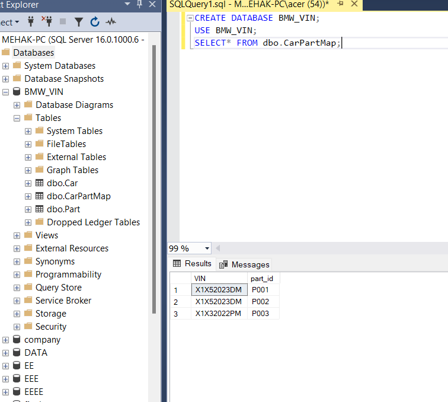

# Part 2: VIN-Based Catalog Filtering (MSSQL Version)

This project loads VIN–Part–Mapping data into Microsoft SQL Server and allows natural language search over it using LangChain.

## 🛠 Tech Used
- MS SQL Server
- Python, Pandas, SQLAlchemy
- LangChain + OpenAI (GPT)

## 📁 Folder Structure
- `data/` → CSVs for VINs, parts, mapping
- `db/init_db.py` → loads data into MS SQL
- `nlp/vin_query_chain.py` → runs LangChain SQL query

## ▶️ How to Run

1. Create MSSQL database `BMW_VIN`
2. Update connection strings in both Python files
3. Run:  
   ```bash
   python db/init_db.py
   python nlp/vin_query_chain.py


## ✅ Visible result in SSMS 


