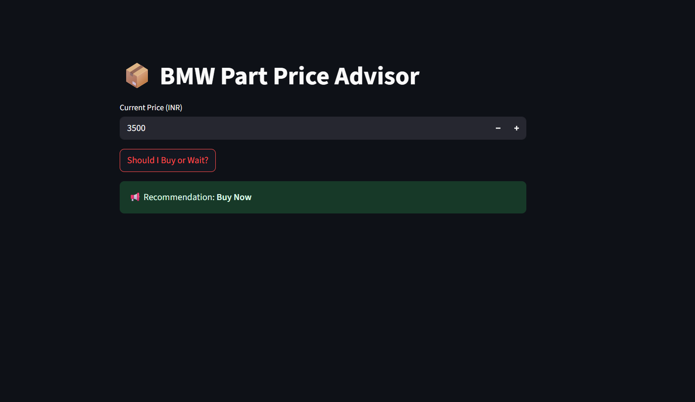

# 📦 BMW Parts Pricing Engine - Buy or Wait Advisor

A machine learning-powered pricing advisor that helps you decide whether to buy BMW parts now or wait for better prices using XGBoost classification and SHAP explainability.

## 🚀 Features

- **Price Prediction**: Uses XGBoost to predict if prices will go up or down
- **Buy/Wait Recommendations**: Get actionable advice based on current prices
- **Interactive Dashboard**: Clean Streamlit UI for easy use
- **SHAP Explainability**: Understand why the model made specific recommendations
- **Real-time Analysis**: Input current prices and get instant recommendations

## 📁 Project Structure

```
part3_pricing_engine/
├── data/
│   └── part_prices.csv          # Historical price data
├── model/
│   ├── train_model.py           # Model training script
│   ├── forecast.py              # Prediction functions
│   ├── explain.py               # SHAP explanations
│   └── pricing_model.pkl        # Trained model (generated)
├── app.py                       # Streamlit dashboard
├── requirements.txt             # Python dependencies
└── README.md                    # This file
```

## 🛠️ Installation & Setup

### 1. Clone/Download the Project
```bash
git clone <your-repo-url>
cd part3_pricing_engine
```

### 2. Install Dependencies
```bash
pip install -r requirements.txt
```

### 3. Train the Model
```bash
python model/train_model.py
```
✅ This creates `model/pricing_model.pkl`

### 4. Run the Dashboard
```bash
streamlit run app.py
```
🌐 Opens at `http://localhost:8501`

## 📊 Data Format

The CSV file should contain:
- `date`: Date in YYYY-MM-DD format
- `part_id`: BMW part identifier (e.g., P001)
- `vendor`: Supplier name (e.g., OEM)
- `price_inr`: Price in Indian Rupees

## STREAMLIT APP



