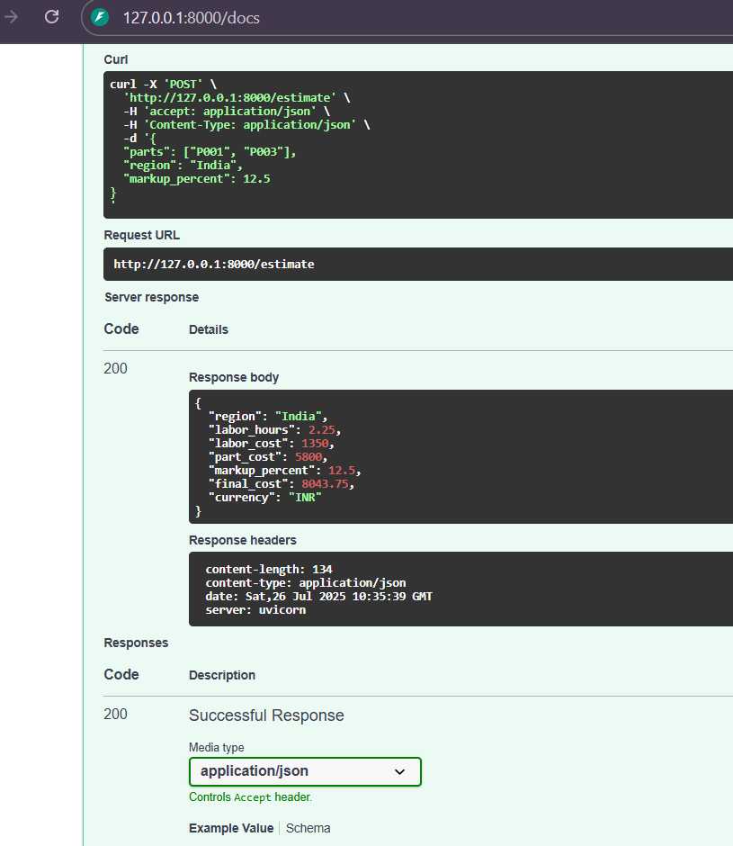

# BMW Repair Cost Estimation API

A FastAPI-based service for estimating BMW vehicle repair costs based on parts, region, and markup percentage.

## Features

- Calculate labor costs based on standard repair times
- Regional pricing support (India, other regions)
- Customizable markup percentage
- JSON API responses with detailed cost breakdown

## Quick Start

### Installation

```bash
pip install fastapi uvicorn pandas
```

### Run the Server

```bash
uvicorn main:app --reload
```

The API will be available at `http://127.0.0.1:8000`

## API Usage

### Endpoint: `POST /estimate`

**Request Body:**
```json
{
  "parts": ["P001", "P003"],
  "region": "India",
  "markup_percent": 12.5
}
```

**Response:**
```json
{
  "region": "India",
  "labor_hours": 2.25,
  "labor_cost": 1350,
  "part_cost": 5800,
  "markup_percent": 12.5,
  "final_cost": 8043.75,
  "currency": "INR"
}
```

### Example using cURL

```bash
curl -X POST "http://127.0.0.1:8000/estimate" \
  -H "Accept: application/json" \
  -H "Content-Type: application/json" \
  -d '{
    "parts": ["P001", "P003"],
    "region": "India",
    "markup_percent": 12.5
  }'
```

## Data Files Required

Place these CSV files in the `data/` directory:

- `labor_standards.csv` - Part labor hours mapping
- `part_prices.csv` - Part pricing information
- `region_rates.csv` - Regional labor rates

## Documentation

Visit `http://127.0.0.1:8000/docs` for interactive API documentation.

## Project Structure

```
├── main.py              # FastAPI application
├── estimator.py         # Cost calculation logic
├── data/
│   ├── labor_standards.csv
│   ├── part_prices.csv
│   └── region_rates.csv
└── README.md
```

## STREAMLIT APP

